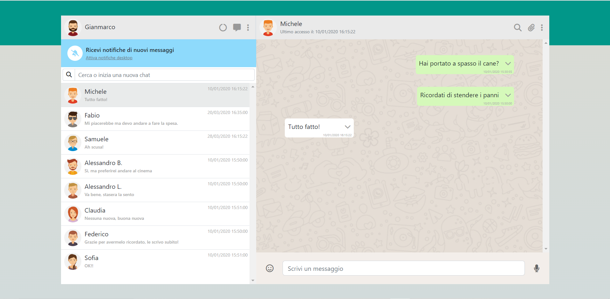

# BOOLZAPP

> Replica dell'aplicazione WhatsApp Web, utilizzando framework Vue.js.

_Svolgimento suddiviso in più Milestone:_

- ## MILESTONE 1:

  - Replica della grafica con la possibilità di avere messaggi scritti dall’utente (verdi) e dall’interlocutore (bianco) assegnando due classi CSS diverse
  - Visualizzazione dinamica della lista contatti: tramite la direttiva v-for, visualizzare nome e immagine di ogni contatto

- ## MILESTONE 2:

  - Visualizzazione dinamica dei messaggi: tramite la direttiva v-for, visualizzare tutti i messaggi relativi al contatto attivo all’interno del pannello della conversazione
  - Click sul contatto mostra la conversazione del contatto cliccato

- ## MILESTONE 3:

  - Aggiunta di un messaggio: l’utente scrive un testo nella parte bassa e digitando “enter” il testo viene aggiunto al thread sopra, come messaggio verde
  - Risposta dall’interlocutore: ad ogni inserimento di un messaggio, l’utente riceverà un “ok” come risposta, che apparirà dopo 1 secondo.

- ## MILESTONE 4:

  - Ricerca utenti: scrivendo qualcosa nell’input a sinistra, vengono visualizzati solo i contatti il cui nome contiene le lettere inserite (es, Marco, Matteo, Martina -> scrivo “mar” rimangono solo Marco e Martina)

- ## MILESTONE 5 (opzionale):
  - Cancella messaggio: cliccando sul messaggio appare un menu a tendina che permette di cancellare il messaggio selezionato
  - Visualizzazione ora e ultimo messaggio inviato/ricevuto nella lista dei contatti

---

## BONUS (opzionali)

- ### Bonus 1:

  _Aggiungere un controllo per evitare che l'utente possa inviare un messaggio vuoto o composto solamente da spazi_

- ### Bonus 2:
  _Accanto all'input dove scrivere il messaggio, visualizzare, solo nel momento in cui l'input non è vuoto, un'altra icona. Ora sarà possibile inviare il messaggio anche premendo questa icona. Dopo aver inviato il messaggio l'input si svuota e torna l'icona di partenza._
